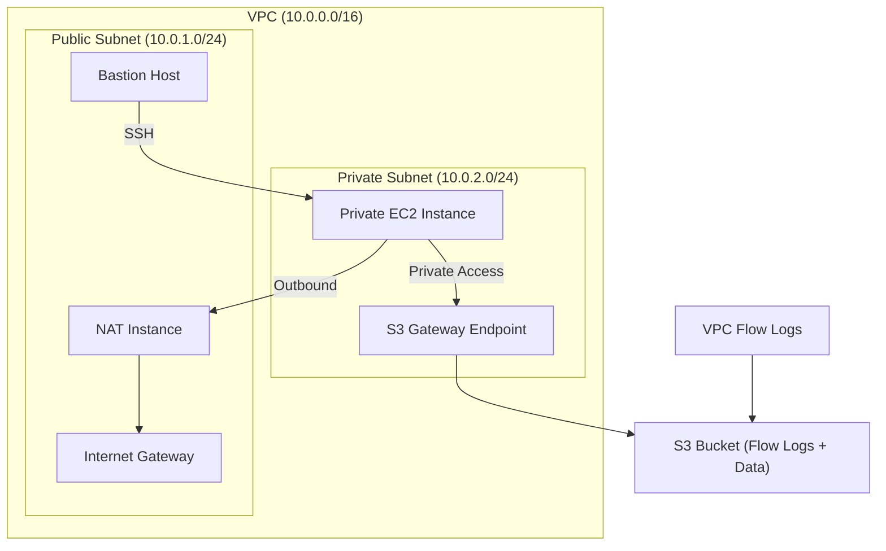

<!--
README for: Secure VPC Foundation — Phase 1
Author: Naseeb Helali
Purpose:
- Provide a production-style yet Free-Tier-friendly baseline for AWS networking.
- Demonstrate Terraform proficiency, infrastructure organization, and operational maturity.
-->

# Secure VPC Foundation — Phase 1

A minimal, production-oriented AWS VPC baseline built entirely with Terraform.  
It demonstrates secure networking, controlled access, and visibility — while staying within the AWS Free Tier.

---

## Objectives
- Build a secure and cost-efficient VPC environment from scratch.  
- Prove hands-on cloud architecture readiness for production workloads.  
- Establish reusable Terraform modules and runbooks for future DevOps automation.  

---

## Architecture Overview

## Key Design Features

Public Subnet → Bastion + NAT instance (source dest check disabled).

Private Subnet → Application EC2 with S3 access via Gateway Endpoint.

Flow Logs → Delivered securely to S3 bucket for network observability.

IAM Roles + SGs → Principle of least privilege and CIDR-restricted SSH.

---

🛠️ Repository Structure

secure-vpc-foundation/
├─ iac/terraform/
│  ├─ providers.tf
│  ├─ versions.tf
│  ├─ variables.tf
│  ├─ locals.tf
│  ├─ networking.tf
│  ├─ security.tf
│  ├─ compute.tf
│  ├─ endpoint.tf
│  ├─ flowlogs.tf
│  ├─ outputs.tf
│  └─ terraform.tfvars
│
├─ runbooks/
│  ├─ connect-via-bastion.md
│  ├─ verify-nat-and-endpoint.md
│  ├─ flowlogs-troubleshooting.md
│  └─ teardown.md
│
├─ tests/
│  └─ checklist.md
│
├─ diagrams/
│  └─ architecture.mmd
│
├─ LICENSE
└─ README.md

---

## Deployment Steps

Initialize Terraform: 

cd iac/terraform
terraform init

Validate Configuration: 

terraform validate
terraform fmt -check

Review the Plan: 

terraform plan

Apply Infrastructure: 

terraform apply -auto-approve

Verify Deployment: 

## Use the runbooks:

runbooks/connect-via-bastion.md — SSH workflow.

runbooks/verify-nat-and-endpoint.md — NAT/S3 connectivity.

runbooks/flowlogs-troubleshooting.md — Log validation.

---

## Validation Checklist

Category	Key Verification

Networking	VPC, subnets, IGW, route tables correctly configured
Security	SSH restricted to admin CIDR; private EC2 isolated
Connectivity	Private EC2 egress via NAT; S3 access via endpoint
Observability	Flow Logs delivered to S3 bucket
Operations	terraform destroy cleans all resources

> See tests/checklist.md for detailed validation steps.

---

## Design Principles

Aspect	Implementation

Security	Bastion-only SSH, private-only app instances
Cost Efficiency	NAT instance (Free Tier) instead of NAT Gateway
Simplicity	Single-AZ, single-region baseline
Observability	VPC Flow Logs → S3 (via IAM role)
Scalability	Ready for multi-AZ, CI/CD, and IaC pipelines in Phase 2

---

## Teardown

When finished testing:

terraform destroy -auto-approve

Then verify:

aws ec2 describe-vpcs --filters "Name=tag:Project,Values=secure-vpc-foundation"
aws s3 ls | grep flowlogs

> Confirm no resources remain to avoid AWS charges.

---

## Phase 2 Roadmap

Future improvements once DevOps toolchain mastery is complete:

Replace NAT Instance → NAT Gateway (HA & scaling).

Introduce Terraform Cloud / S3 remote backend.

Add CI/CD pipeline (GitHub Actions) for validation + plan checks.

Integrate CloudWatch Logs Insights / Athena queries for Flow Logs analytics.

Implement AWS SSM Session Manager for keyless bastion access.
